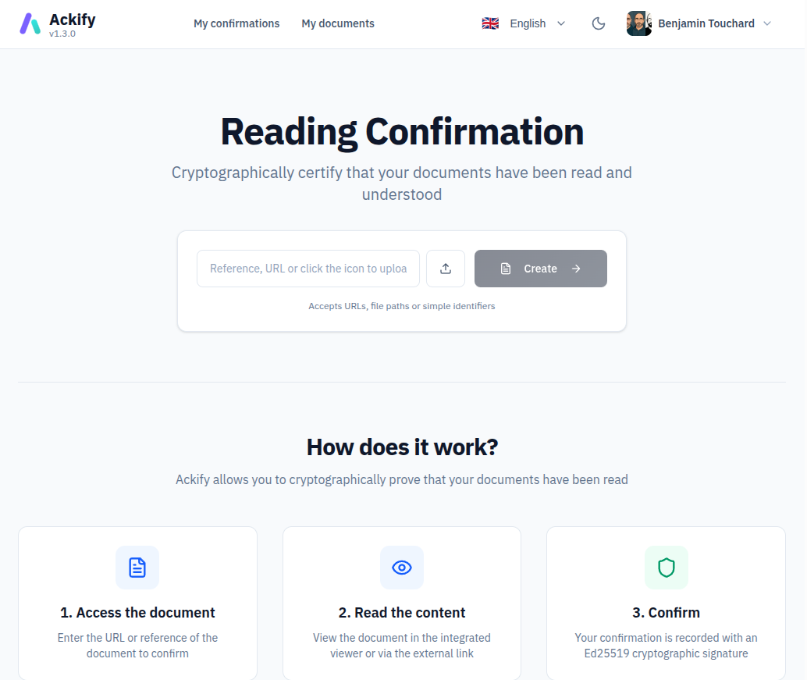
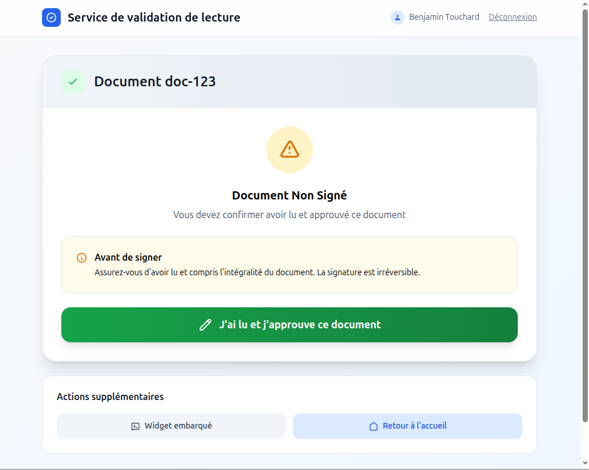
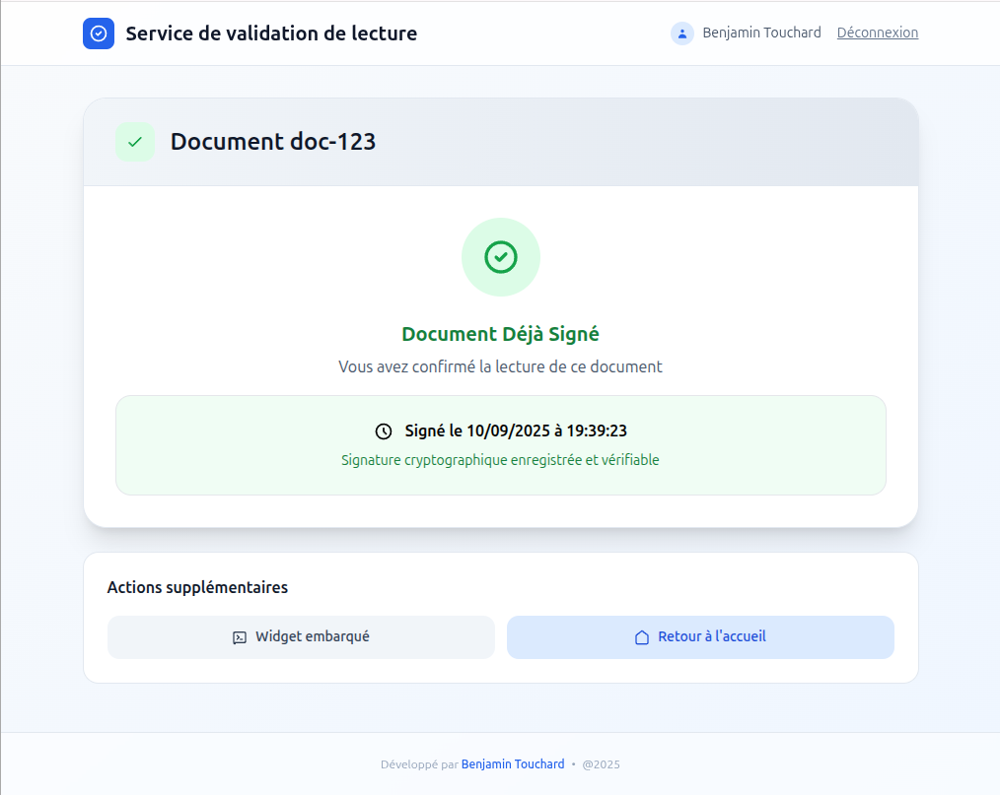
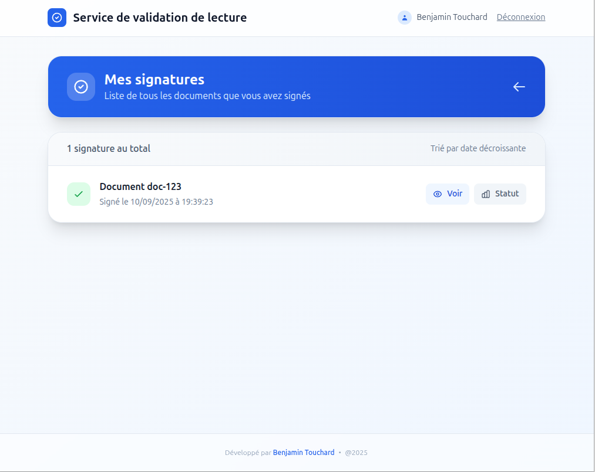
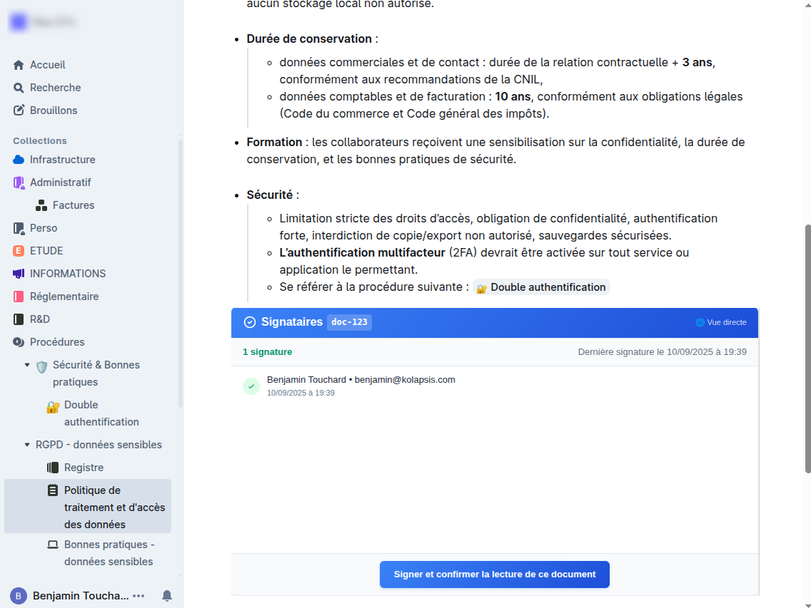
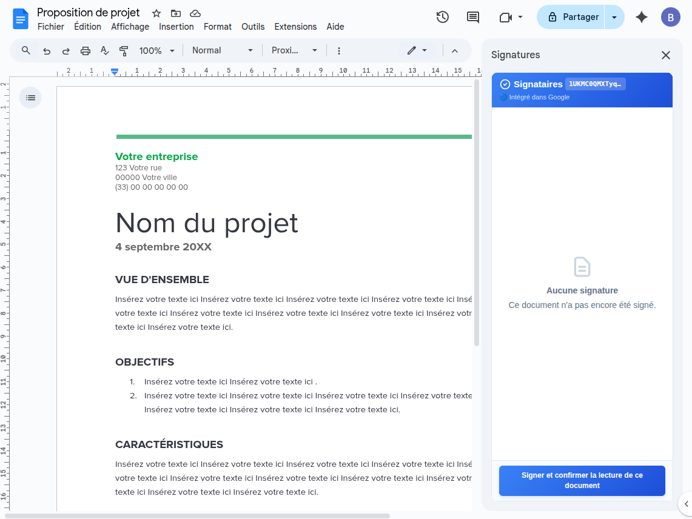

# 🔐 Ackify

> **Proof of Read. Compliance made simple.**

Secure document reading validation with cryptographic signatures and irrefutable proof.

[](https://github.com/btouchard/ackify-ce/actions/workflows/ci.yml)
[](https://codecov.io/gh/btouchard/ackify-ce)
[](https://en.wikipedia.org/wiki/EdDSA)
[](https://golang.org/)
[](LICENSE)

> 🇫🇷 [Version française disponible ici](README_FR.md)

**Website**: https://www.ackify.eu

---

## 🎯 Why Ackify?

Prove that collaborators have read and acknowledged important documents with **Ed25519 cryptographic signatures**.

**Use Cases**:
- Security policy validation
- Training attestations
- GDPR acknowledgment
- Contractual agreements
- Compliance procedures

**Key Features**:
- ✅ Ed25519 cryptographic signatures
- ✅ OAuth2 authentication (Google, GitHub, GitLab, custom)
- ✅ One signature per user/document (database enforced)
- ✅ Immutable audit trail
- ✅ Expected signers tracking with email reminders
- ✅ Document checksum verification (SHA-256/512, MD5)
- ✅ Public embeddable widgets (Notion, Outline, etc.)
- ✅ Admin dashboard (Vue.js 3 + dark mode)
- ✅ Multilingual (fr, en, es, de, it)

---

## ⚡ Quick Start

### Prerequisites

- Docker & Docker Compose
- OAuth2 credentials (Google, GitHub, or GitLab)

### Installation

#### Option 1: Automated Installation Script (Recommended)

```bash
# Download and run installation script
curl -fsSL https://raw.githubusercontent.com/btouchard/ackify-ce/main/install/install.sh | bash

# Navigate to installation directory
cd ackify-ce

# Edit configuration with your OAuth2 credentials
nano .env

# Start services
docker compose up -d

# Access web interface
open http://localhost:8080
```

**What the script does:**
- Downloads `compose.yml` and `.env.example`
- Generates secure secrets automatically:
  - `ACKIFY_OAUTH_COOKIE_SECRET` (AES-256 session encryption)
  - `POSTGRES_PASSWORD` (database password)
- Creates ready-to-use `.env` file
- You only need to add your OAuth2 credentials

#### Option 2: Manual Installation

```bash
# Clone repository
git clone https://github.com/btouchard/ackify-ce.git
cd ackify-ce

# Configure
cp .env.example .env
nano .env  # Edit with your OAuth2 credentials and generate secrets

# Start services
docker compose up -d

# Verify
curl http://localhost:8080/api/v1/health
# Expected: {"status":"healthy","database":"connected"}

# Access web interface
open http://localhost:8080
```

### Required Environment Variables

```bash
# Application
APP_DNS=sign.your-domain.com
ACKIFY_BASE_URL=https://sign.your-domain.com
ACKIFY_ORGANISATION="Your Organization"

# Database
POSTGRES_USER=ackifyr
POSTGRES_PASSWORD=your_secure_password
POSTGRES_DB=ackify

# OAuth2 (example with Google)
ACKIFY_OAUTH_PROVIDER=google
ACKIFY_OAUTH_CLIENT_ID=your_client_id
ACKIFY_OAUTH_CLIENT_SECRET=your_client_secret

# Security (generate with: openssl rand -base64 32)
ACKIFY_OAUTH_COOKIE_SECRET=your_base64_secret
```

See [docs/en/configuration.md](docs/en/configuration.md) for all options.

---

## 📸 Screenshots

<table>
<tr>
<td align="center"><strong>Home</strong><br><a href="screenshots/1-home.png"></a></td>
<td align="center"><strong>Signing</strong><br><a href="screenshots/2-signing-request.png"></a></td>
<td align="center"><strong>Confirmed</strong><br><a href="screenshots/3-signing-ok.png"></a></td>
</tr>
<tr>
<td align="center"><strong>Signatures</strong><br><a href="screenshots/4-sign-list.png"></a></td>
<td align="center"><strong>Outline</strong><br><a href="screenshots/5-integrated-to-outline.png"></a></td>
<td align="center"><strong>Google Docs</strong><br><a href="screenshots/6-integrated-to-google-doc.png"></a></td>
</tr>
</table>

**Videos**: [1-initialize-sign.webm](screenshots/videos/1-initialize-sign.webm) | [2-user-sign-flow.webm](screenshots/videos/2-user-sign-flow.webm)

---

## 📚 Documentation

### Getting Started
- **[Getting Started](docs/en/getting-started.md)** - Installation & first steps
- **[Configuration](docs/en/configuration.md)** - Environment variables
- **[OAuth Providers](docs/en/configuration/oauth-providers.md)** - Google, GitHub, GitLab, Custom
- **[Email Setup](docs/en/configuration/email-setup.md)** - SMTP configuration

### Features
- **[Signatures](docs/en/features/signatures.md)** - Ed25519 cryptographic flow
- **[Expected Signers](docs/en/features/expected-signers.md)** - Tracking & reminders
- **[Checksums](docs/en/features/checksums.md)** - Document integrity verification
- **[Embedding](docs/en/features/embedding.md)** - oEmbed, iframes, integrations
- **[i18n](docs/en/features/i18n.md)** - Internationalization (5 languages)

### Technical
- **[Architecture](docs/en/architecture.md)** - Tech stack & design principles
- **[Database](docs/en/database.md)** - PostgreSQL schema & migrations
- **[API Reference](docs/en/api.md)** - REST endpoints & examples
- **[Deployment](docs/en/deployment.md)** - Production with Docker Compose
- **[Development](docs/en/development.md)** - Contributing & setup

---

## 🚀 Usage

### Request a Signature

```
https://your-domain.com/?doc=security_policy_2025
```

User authenticates via OAuth2 and signs with one click.

### Embed in Your Tools

**iFrame**:
```html
<iframe src="https://your-domain.com/?doc=policy_2025"
        width="600" height="200" frameborder="0"></iframe>
```

**oEmbed** (Notion, Outline, Confluence):
```
Just paste the URL - automatic embed via oEmbed discovery
```

**Open Graph** (Slack, Teams):
```
URL unfurls automatically with signature count
```

See [docs/en/features/embedding.md](docs/en/features/embedding.md) for details.

---

## 🛡️ Security

- **Ed25519** - State-of-the-art elliptic curve signatures
- **SHA-256** - Payload hashing for tampering detection
- **PKCE** - OAuth2 security (automatic)
- **AES-256-GCM** - Encrypted refresh tokens
- **Immutable timestamps** - PostgreSQL triggers
- **Rate limiting** - 5 auth/min, 100 req/min
- **HTTPS enforced** - Secure cookies only

See [docs/en/architecture.md](docs/en/architecture.md) for full security details.

---

## 🔧 Tech Stack

**Backend**: Go 1.24.5, PostgreSQL 16, Chi Router, OAuth2, Ed25519

**Frontend**: Vue 3, TypeScript, Vite, Pinia, Tailwind CSS, shadcn/vue

**DevOps**: Docker, Multi-stage builds, Distroless image (< 30MB)

**i18n**: 5 languages (fr, en, es, de, it)

**Coverage**: 72.6% (180+ unit tests, 33 integration tests)

---

## 🤝 Support

- **Issues**: [GitHub Issues](https://github.com/btouchard/ackify-ce/issues)
- **Discussions**: [GitHub Discussions](https://github.com/btouchard/ackify-ce/discussions)
- **Email**: contact@ackify.eu

---

## 📄 License

AGPLv3 - See [LICENSE](LICENSE) for details.

---

**Developed with ❤️ by [Benjamin TOUCHARD](https://www.kolapsis.com)**
