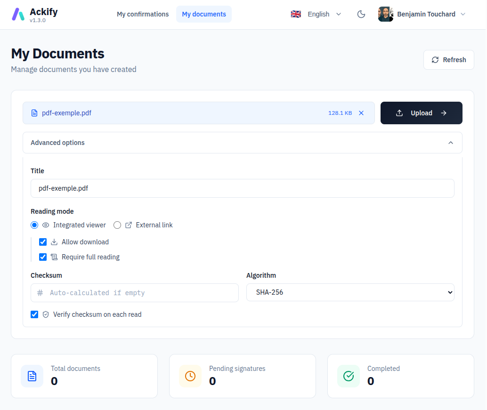
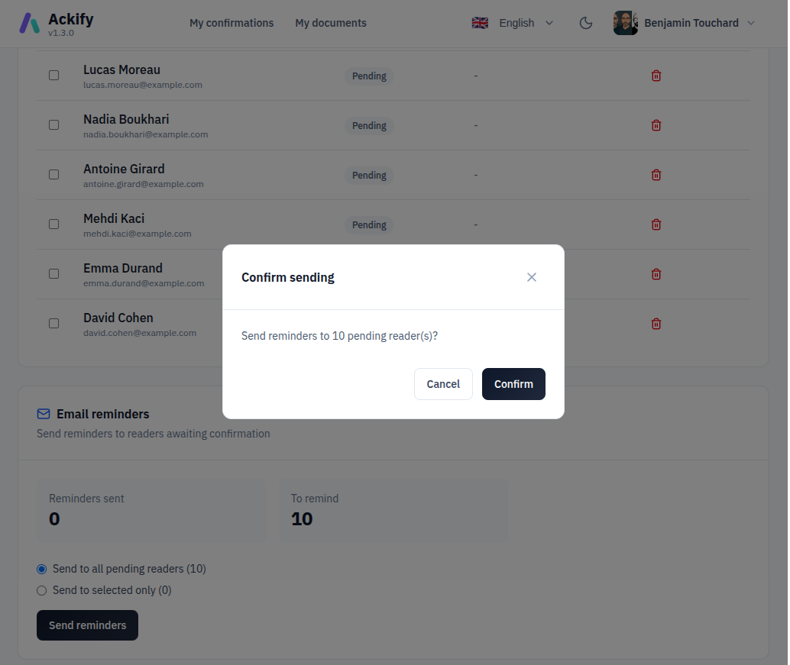
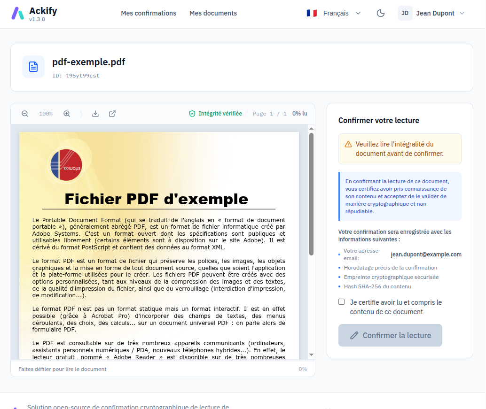
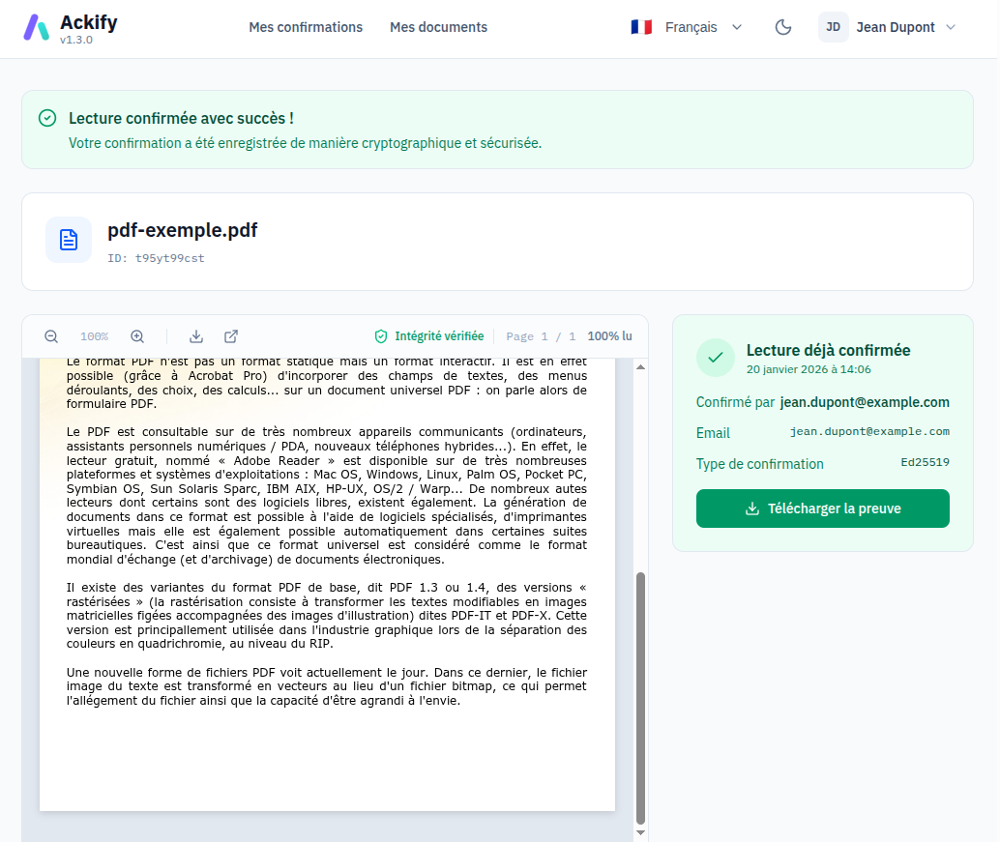
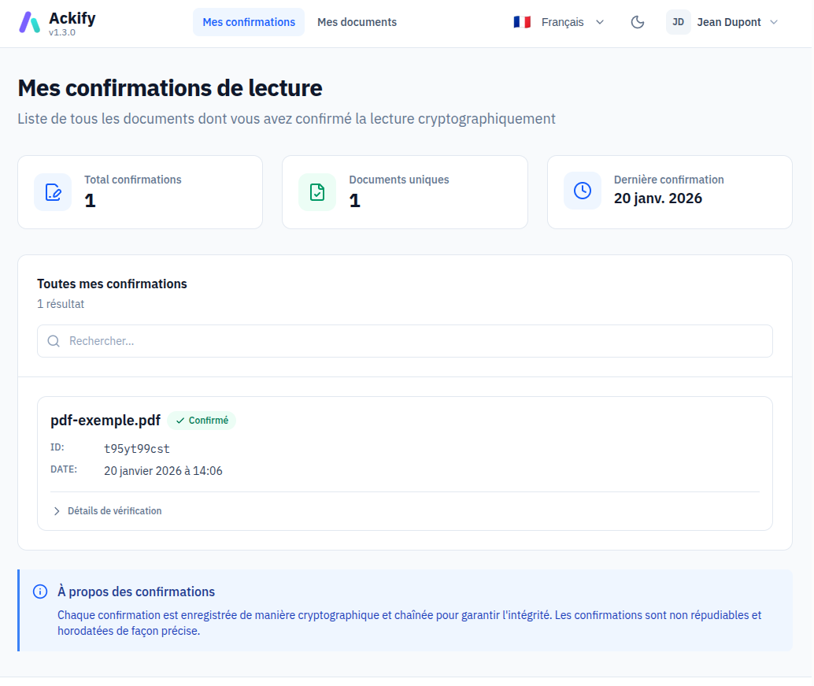
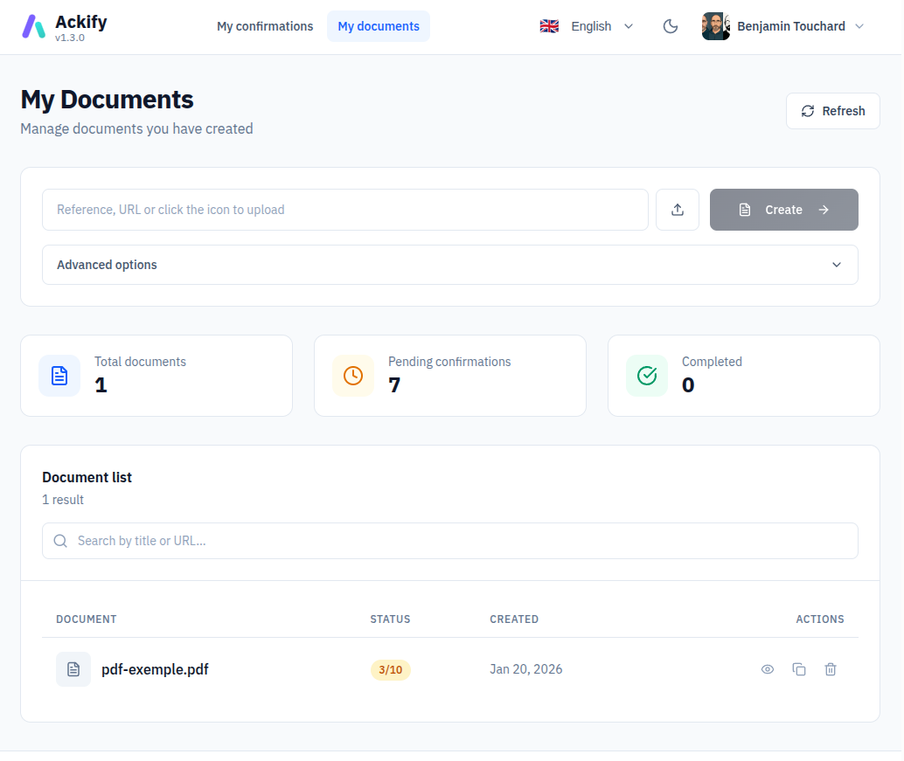
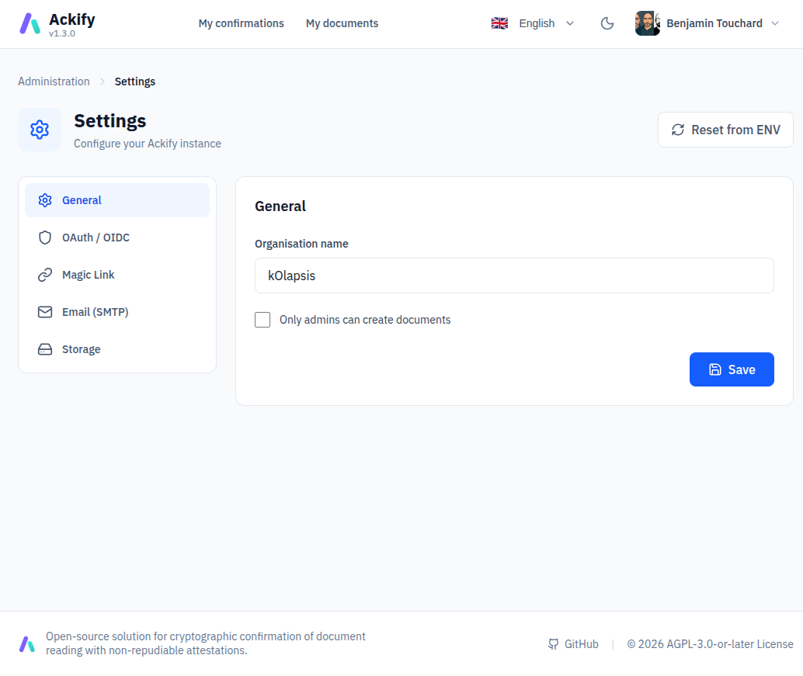

# 🔐 Ackify

> **Proof of Read. Compliance made simple.**

Service sécurisé de validation de lecture avec signatures cryptographiques et preuves incontestables.

[](https://github.com/btouchard/ackify-ce/actions/workflows/ci.yml)
[](https://codecov.io/gh/btouchard/ackify-ce)
[](https://en.wikipedia.org/wiki/EdDSA)
[](https://golang.org/)
[](LICENSE)

> 🌍 [English version available here](README.md)

**Site web** : https://www.ackify.eu/fr

---

## 🎯 Pourquoi Ackify ?

Prouvez que vos collaborateurs ont lu et pris connaissance de documents importants avec des **signatures cryptographiques Ed25519**.

**Cas d'usage** :
- Validation de politiques de sécurité
- Attestations de formation
- Prise de connaissance RGPD
- Accusés de réception contractuels
- Procédures de conformité

**Fonctionnalités clés** :
- ✅ Signatures cryptographiques Ed25519
- ✅ **Authentification flexible** : OAuth2 (Google, GitHub, GitLab, custom) ou MagicLink (email sans mot de passe)
- ✅ Une signature par utilisateur/document (contrainte base de données)
- ✅ Piste d'audit immutable
- ✅ Tracking signataires attendus avec rappels email
- ✅ Vérification checksums documents (SHA-256/512, MD5)
- ✅ Stockage de documents optionnel (système de fichiers local ou compatible S3)
- ✅ Widgets intégrables publics (Notion, Outline, etc.)
- ✅ Dashboard admin (Vue.js 3 + mode sombre)
- ✅ Multilingue (fr, en, es, de, it)

---

## ⚡ Démarrage Rapide

### Prérequis

- Docker & Docker Compose
- **Au moins UNE méthode d'authentification** :
  - Credentials OAuth2 (Google, GitHub, ou GitLab), OU
  - Serveur SMTP pour MagicLink (authentification email sans mot de passe)

### Installation

#### Option 1 : Script d'Installation Automatisé (Recommandé)

```bash
# Télécharger et exécuter le script d'installation
bash <(curl -fsSL https://raw.githubusercontent.com/btouchard/ackify-ce/main/install/install.sh)

# Naviguer vers le répertoire d'installation
cd ackify-ce

# Éditer la configuration avec vos credentials OAuth2
nano .env

# Démarrer les services
docker compose up -d

# Accéder à l'interface web
open http://localhost:8080
```

**Ce que fait le script :**
- Télécharge `compose.yml` et `.env.example`
- Génère automatiquement des secrets sécurisés :
  - `ACKIFY_OAUTH_COOKIE_SECRET` (chiffrement session AES-256)
  - `POSTGRES_PASSWORD` (mot de passe base de données)
- Crée un fichier `.env` prêt à l'emploi
- Vous n'avez qu'à ajouter vos credentials OAuth2

#### Option 2 : Installation Manuelle

```bash
# Cloner le dépôt
git clone https://github.com/btouchard/ackify-ce.git
cd ackify-ce

# Configurer
cp .env.example .env
nano .env  # Éditer avec vos credentials OAuth2 et générer les secrets

# Démarrer les services
docker compose up -d

# Vérifier
curl http://localhost:8080/api/v1/health
# Attendu: {"status":"healthy","database":"connected"}

# Accéder à l'interface web
open http://localhost:8080
```

### Variables d'Environnement Requises

```bash
# Application
APP_DNS=sign.votre-domaine.com
ACKIFY_BASE_URL=https://sign.votre-domaine.com
ACKIFY_ORGANISATION="Votre Organisation"

# Base de données
POSTGRES_USER=ackifyr
POSTGRES_PASSWORD=votre_mot_de_passe_securise
POSTGRES_DB=ackify

# Sécurité (générer avec: openssl rand -base64 32)
ACKIFY_OAUTH_COOKIE_SECRET=votre_secret_base64

# ============================================================================
# Authentification (choisir AU MOINS UNE méthode)
# ============================================================================

# Option 1 : OAuth2 (Google, GitHub, GitLab, custom)
ACKIFY_OAUTH_PROVIDER=google
ACKIFY_OAUTH_CLIENT_ID=votre_client_id
ACKIFY_OAUTH_CLIENT_SECRET=votre_client_secret

# Option 2 : MagicLink (authentification email sans mot de passe)
# ACKIFY_MAIL_HOST=smtp.example.com
# ACKIFY_MAIL_PORT=587
# ACKIFY_MAIL_USERNAME=votre_utilisateur_smtp
# ACKIFY_MAIL_PASSWORD=votre_mot_de_passe_smtp
# ACKIFY_MAIL_FROM=noreply@example.com
```

**Auto-détection** :
- OAuth activé automatiquement si `ACKIFY_OAUTH_CLIENT_ID` et `ACKIFY_OAUTH_CLIENT_SECRET` sont définis
- MagicLink activé automatiquement si `ACKIFY_MAIL_HOST` est configuré
- Vous pouvez utiliser **les deux méthodes simultanément** pour une flexibilité maximale

Voir [docs/fr/configuration.md](docs/fr/configuration.md) pour toutes les options.

---

## 📸 Captures d'écran

<table>
<tr>
<td align="center"><strong>Accueil</strong><br><a href="screenshots/1-home.png"></a></td>
<td align="center"><strong>Upload document</strong><br><a href="screenshots/2-new-doc-upload.png"></a></td>
<td align="center"><strong>Ajouter lecteurs</strong><br><a href="screenshots/3-add-confirm-request.png"></a></td>
<td align="center"><strong>Lecteur intégré</strong><br><a href="screenshots/4-internal-reader.png"></a></td>
</tr>
<tr>
<td align="center"><strong>Lecture confirmée</strong><br><a href="screenshots/5-read-confirmed.png"></a></td>
<td align="center"><strong>Mes confirmations</strong><br><a href="screenshots/6-all-my-confirmations.png"></a></td>
<td align="center"><strong>Mes documents</strong><br><a href="screenshots/7-manage-my-docs.png"></a></td>
<td align="center"><strong>Admin paramètres</strong><br><a href="screenshots/8-admin-settings.png"></a></td>
</tr>
</table>

---

## 📚 Documentation

### Démarrage
- **[Démarrage Rapide](docs/fr/getting-started.md)** - Installation & premiers pas
- **[Configuration](docs/fr/configuration.md)** - Variables d'environnement
- **[OAuth Providers](docs/fr/configuration/oauth-providers.md)** - Google, GitHub, GitLab, Custom
- **[Configuration Email](docs/fr/configuration/email-setup.md)** - Configuration SMTP

### Fonctionnalités
- **[Signatures](docs/fr/features/signatures.md)** - Flow cryptographique Ed25519
- **[Signataires Attendus](docs/fr/features/expected-signers.md)** - Tracking & rappels
- **[Checksums](docs/fr/features/checksums.md)** - Vérification intégrité documents
- **[Stockage Documents](docs/fr/features/storage.md)** - Upload optionnel (local ou S3)
- **[Embedding](docs/fr/features/embedding.md)** - oEmbed, iframes, intégrations
- **[i18n](docs/fr/features/i18n.md)** - Internationalisation (5 langues)

### Technique
- **[Architecture](docs/fr/architecture.md)** - Stack technique & principes de conception
- **[Base de Données](docs/fr/database.md)** - Schéma PostgreSQL & migrations
- **[API Reference](docs/fr/api.md)** - Endpoints REST & exemples
- **[Déploiement](docs/fr/deployment.md)** - Production avec Docker Compose
- **[Développement](docs/fr/development.md)** - Contribution & setup

---

## 🚀 Utilisation

### Demander une Signature

```
https://votre-domaine.com/?doc=politique_securite_2025
```

L'utilisateur s'authentifie (OAuth2 ou MagicLink) et signe en un clic.

### Intégrer dans vos Outils

**iFrame** :
```html
<iframe src="https://votre-domaine.com/embed?doc=politique_2025"
        width="600" height="200" frameborder="0"></iframe>
```

**oEmbed** (Notion, Outline, Confluence) :
```
Collez l'URL embed : https://votre-domaine.com/embed?doc=politique_2025
Embed automatique via oEmbed discovery
```

**Open Graph** (Slack, Teams) :
```
Collez l'URL directe : https://votre-domaine.com/?doc=politique_2025
L'URL se déploie automatiquement avec le nombre de signatures
```

> **Important** : Utilisez `/embed?doc=...` pour les intégrations iframe (Notion, Outline) et `/?doc=...` pour les liens directs (emails, Slack).

Voir [docs/fr/features/embedding.md](docs/fr/features/embedding.md) pour les détails.

---

## 🛡️ Sécurité

- **Ed25519** - Signatures courbe elliptique de pointe
- **SHA-256** - Hachage payload pour détection altération
- **PKCE** - Sécurité OAuth2 (automatique)
- **AES-256-GCM** - Refresh tokens chiffrés
- **Horodatages immutables** - Triggers PostgreSQL
- **Rate limiting** - 5 auth/min, 100 req/min
- **HTTPS forcé** - Cookies sécurisés uniquement

Voir [docs/fr/architecture.md](docs/fr/architecture.md) pour tous les détails sécurité.

---

## 🔧 Stack Technique

**Backend** : Go 1.24.5, PostgreSQL 16, Chi Router, OAuth2, Ed25519

**Frontend** : Vue 3, TypeScript, Vite, Pinia, Tailwind CSS, shadcn/vue

**DevOps** : Docker, Builds multi-étapes, Image Distroless (< 30MB)

**i18n** : 5 langues (fr, en, es, de, it)

**Coverage** : 72.6% (180+ tests unitaires, 33 tests d'intégration)

---

## 🤝 Support

- **Issues** : [GitHub Issues](https://github.com/btouchard/ackify-ce/issues)
- **Discussions** : [GitHub Discussions](https://github.com/btouchard/ackify-ce/discussions)
- **Email** : contact@ackify.eu

---

## 📄 Licence

AGPLv3 - Voir [LICENSE](LICENSE) pour les détails.

---

**Développé avec ❤️ par [Benjamin TOUCHARD](https://www.kolapsis.com)**
